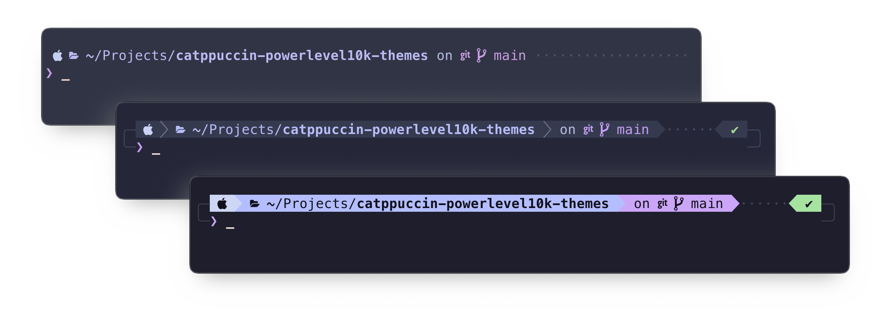
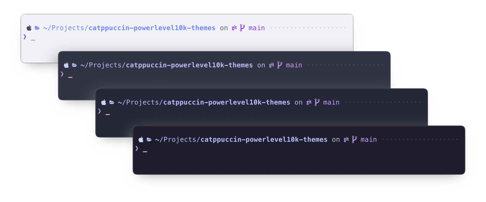
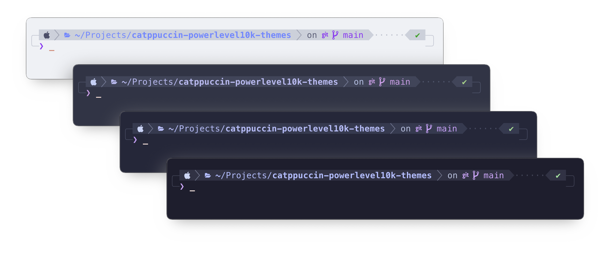
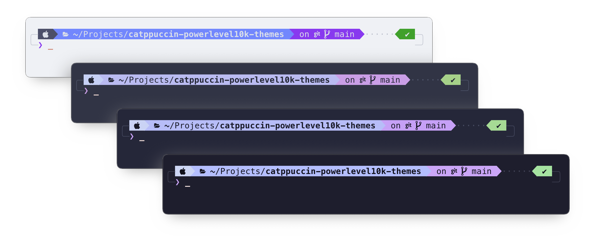
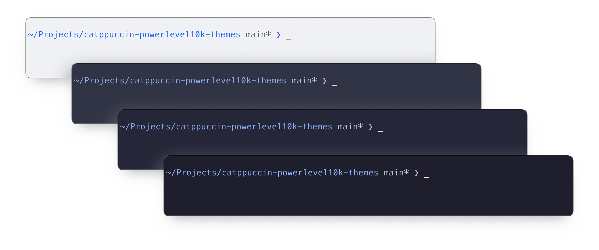
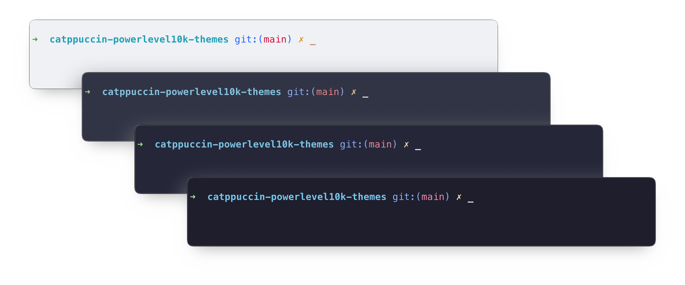

<h1 align="center">
  Catppuccin Powerlevel10k Themes
</h1>

  

[**Powerlevel10k**](https://github.com/romkatv/powerlevel10k) themes inspired by the [**Catppuccin**](https://catppuccin.com/) color palettes. These themes are available in multiple styles and support all four Catppuccin palettes: **🌻 Latte**, **🪴 Frappé**, **🌺 Macchiato**, and **🌿 Mocha**.

## Available Themes

A collection of Powerlevel10k themes designed for a beautiful and functional terminal experience.

### Lean

Below is a list of available themes, which can be found in the [themes folder](./themes).

---

### Classic

A balanced and minimalistic design with clean lines, perfect for users seeking simplicity.

---

### Rainbow

A vibrant and colorful theme for users who love a playful and expressive look.

---

### Pure

A sleek and elegant design with minimal decorations, inspired by the [Pure prompt](https://github.com/sindresorhus/pure). Ideal for a modern and refined look.

---

### RobbyRussell

The classic Powerlevel10k RobbyRussell layout reimagined with Catppuccin palettes. Inspired by the original [Oh My Zsh RobbyRussell theme](https://github.com/ohmyzsh/ohmyzsh/blob/master/themes/robbyrussell.zsh-theme).

